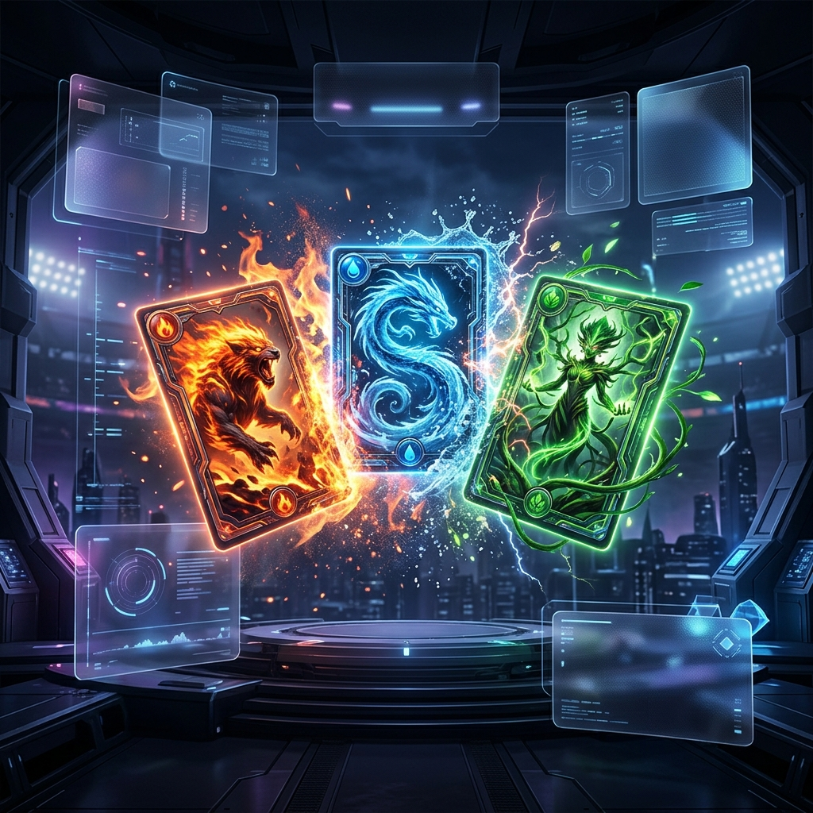

# 🌟 Pokémon TCG Web (Lite)




這是一個以現代化 Web 技術 (React + Vite) 打造的**精簡版寶可夢集換式卡牌對戰遊戲 (Pokémon TCG)**。專為網頁瀏覽器設計，提供流暢的本地雙人對戰體驗，無需安裝任何軟體即可隨時隨地享受卡牌對戰的樂趣！

## 🎯 遊戲特色 (Features)

*   **🃏 經典對戰還原**：重現經典的寶可夢卡牌對戰機制，包含：派出戰鬥寶可夢、放置備戰寶可夢、填附能量卡、發動攻擊與拿取獎賞卡。
*   **✨ 現代化質感 UI (Glassmorphism)**：全站採用毛玻璃 (Glassmorphism) 特效設計，搭配深色科技感主題，呈現出頂級電競轉播風格的視覺體驗。
*   **📱 沉浸式 HUD 介面**：首創四角隱藏式 Heads-Up Display (HUD)，將玩家與對手的資訊優雅地收納於畫面角落，讓戰鬥區域 100% 無遮蔽。
*   **🖱️ 直覺的拖曳操作 (Drag & Drop)**：完美支援 HTML5 原生拖曳功能。無論是從手牌派寶可夢上陣，或是為寶可夢填附能量，都能透過滑鼠輕鬆拖曳完成。
*   **🎬 生動的互動動畫**：包含「自動收合/展開手牌」、「攻擊震動特效」、「傷害數字浮動動畫」以及「優雅的提示訊息 (Toast)」，讓每一次操作都充滿回饋感。
*   **📜 即時對戰紀錄 (Game Log)**：內建隱藏式抽屜對戰紀錄面板，詳細記錄雙方玩家的每一個關鍵操作與傷害數據，戰況一目了然。

## 🎮 玩法簡介 (How to Play)

本遊戲支援**本地雙人熱座模式 (Hotseat)**，雙方玩家輪流在同一個螢幕上進行操作。

1.  **回合切換**：每一回合結束時，遊戲場地會自動 180 度翻轉，讓當前行動的玩家永遠保持在畫面下方（主視角）。
2.  **出牌**：你可以透過「點擊」或「拖曳」將下方的卡牌放置到中央的「戰鬥區 (Active)」或「備戰區 (Bench)」。
3.  **填附能量**：將能量卡拖曳至場上的寶可夢，只要能量達到攻擊需求，即可點擊右下角的「發動攻擊」。
4.  **獲勝條件**：當對手的戰鬥寶可夢生命值歸零時，將其擊倒並拿取一張獎賞卡。率先將對手擊倒並拿完獎賞卡的玩家即為贏家！

## 🛠️ 技術棧 (Tech Stack)

*   **框架**：[React 18](https://reactjs.org/)
*   **建置工具**：[Vite](https://vitejs.dev/)
*   **狀態管理**：React Hooks (`useState`, `useEffect`)
*   **樣式**：Vanilla CSS3 (利用 CSS Variables, Flexbox, Keyframe Animations 打造全客製化樣式)
*   **字體**：Google Fonts (Noto Sans TC)

## 🚀 本地端運行 (Local Setup)

請確保您的電腦已安裝 [Node.js](https://nodejs.org/)。

```bash
# 1. 複製專案到本地
git clone https://github.com/your-username/pokemon-tcg-web.git

# 2. 進入專案目錄
cd pokemon-tcg-web

# 3. 安裝依賴套件
npm install

# 4. 啟動開發伺服器
npm run dev
```
啟動後，請打開瀏覽器並前往終端機提示的本地網址（通常是 `http://localhost:5173`）即可開始遊戲！

---
*Disclaimer: This is a fan-made project for educational purposes. Pokémon and Pokémon character names are trademarks of Nintendo.*
