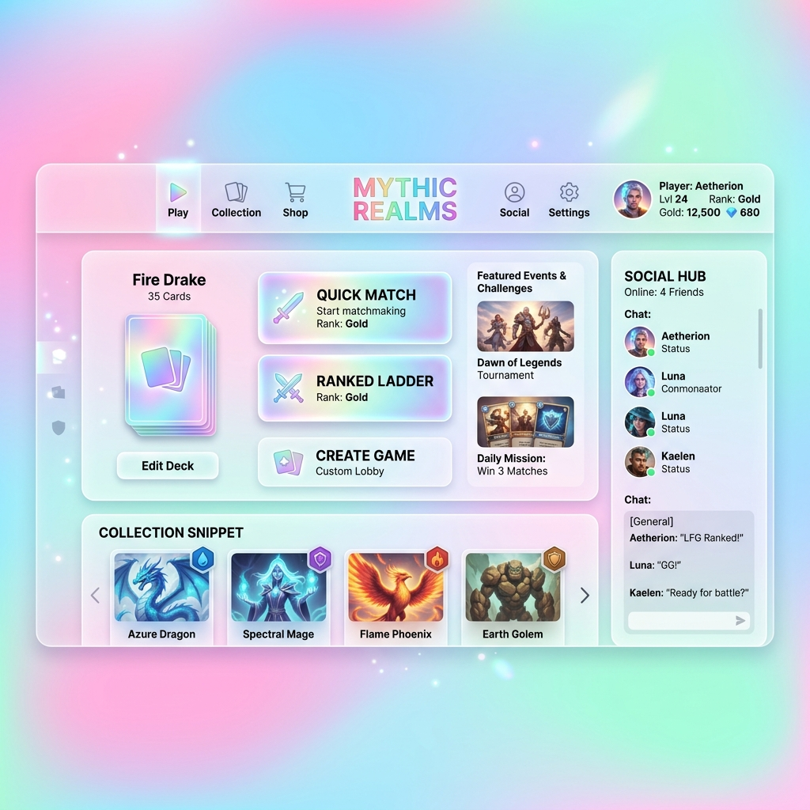

# 視覺主題規範：方案 B (明亮全息玻璃 Light Holographic Glass)

## 💡 概念與核心精神
本遊戲將採用 **「明亮全息玻璃 (Light Holographic Glass)」** 作為主要視覺基調。
徹底擺脫傳統卡牌遊戲過於深沉死寂的「深色模式」包袱，以極致的**空氣感、高透度、活潑明亮**為目標，完美烘托出 Q 版寶可夢的可愛與現代休閒手遊的頂級質感 (Premium Casual)。

## 🎨 色彩與視覺元素 (Visual Elements)

1. **環境背景 (Environment Background)**
   - 捨棄純黑或深灰。
   - 使用明亮、粉嫩的 **「彩色網格漸層 (Pastel Mesh Gradient)」** 作為基底。
   - 核心色系：櫻花粉 (Soft Pink)、天空藍 (Sky Blue)、薄荷綠 (Mint Green) 的柔和交織。

2. **玻璃擬物化 (Frosted Glass Panels)**
   - 介面面板（如卡牌庫、對戰 HUD、對話框）全面採用 **「白色半透明毛玻璃」**。
   - CSS 核心特性：`background: rgba(255, 255, 255, 0.4)` 搭配高強度 `backdrop-filter: blur(15px)`。
   - 邊框反光：使用 `1px solid rgba(255, 255, 255, 0.8)` 營造細緻的玻璃切邊高光。

3. **文字與對比 (Typography & Contrast)**
   - 由於背景為淺色系，主要的閱讀文字須轉為**深色**（如 `#1e293b` 或深邃的海軍藍），確保良好的對比度。
   - 陰影 (`box-shadow`) 放棄沉重的純黑色，改採帶有環境光色調的柔和散景陰影。

## 🖼️ 視覺示意圖 (Mockup Reference)
下圖為此主題風格的概念示意圖，展示了明亮漸層與白色毛玻璃交疊的視覺層次感：

